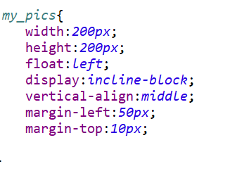
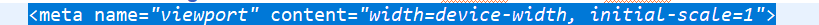

# Pj1实验报告
### 一、基本信息
姓名：赵一玲
学号：18300290055

GitHub地址：https://github.com/mikollin/SOFT130002_pj1

GitHub Pages地址：https://mikollin.github.io/SOFT130002_pj1/

### 二、项目完成情况
假设网站名字为“Hello World”
首先我创建的是登录页和注册页的设计。只有header和footer。
选择占据大半的为header，总体用背景图占据，再上面显示网页的欢迎字样，登录和注册都用了小框框起来，形成强调，整齐的感觉。
两个输入框中，密码的框，设置type=“password”使得密码不会显示出来，在登陆页面中，如果还未注册，可以点击超链接跳转到注册页面，注册页面的sign up键会回到登陆页面，最后通过log in进入浏览页。
下面的footer大致样式，学习了别的网站，文字采用居中做法，留出上边距，周围留出空边，。

然后创建主页home页，head基本与登录页相呼应，采用一样的背景和欢迎语。
之后是导航栏用ul实现。将所处页面高亮，然后运用hover使鼠标点上去会变色，同时对于超链接的格式也做了更改，去除下划线并更改了适当的颜色。My account有二级菜单，这里用li嵌套ul实现。基本功能同上。还要有小图标。（之后的页面都用这个导航栏，直接复制粘贴了）
在下面是一张头图。为了形式统一，我设置了一圈黑色边框。
下面是8张图片展示。把图片和对应的说明文字一起框起来，图片可点击跳转到图片详情页，框与框之间采取间隔分离margin-right:20px;margin-left:20px;然后并成一行设置display为incline-block;；然后文字部分采用缩写：

```
  overflow: hidden;
  text-overflow: ellipsis;
   /*这样超出2行的部分被截取，显示...*/
  display: -webkit-box;
  -webkit-line-clamp: 1;
  -webkit-box-orient: vertical;
```

页脚同登录页面。之后的所有页面都用这个页脚，直接复制粘贴了。

之后我创建的是browse页，设置侧边栏sidebar，均靠左float:left,并设置一定间距，然后设置快速搜索的标签栏（也属于侧边栏一种），并设置鼠标放上去高亮，点击后刷新页面会出现“已筛选”的窗口提示。然后是filter这块，主要难度在于设置select二级联动，首先对于content country city设置属性selected="selected"使得其为默认选项，同时设置disabled selected hidden不让他们出现在下拉的选项中，使用js建立二级联动，根据country的selectedindex对应新建选项，设置对应的首都为默认被选中,由于首都不是0，即第一个选项，做些设置（false,true; 第一个TRUE是(默认被选项，即焦点的在项，只有一个)defaultselected，相当于<option selected></option>第二个TRUE是被选择项（可多行被选择），用于multiple模式），之后设置一些展示的图片，用白边把他们框起来设置统一的间距。最后在filter底部设置页面转换，每个数字都可点，hover变色，最左尖括号和最右尖括号分别为首页和末页。

接下来是search页，设置单选项radio，后面跟搜索需要填的文本框，默认是以标题查找，最后是filter按钮，有alert提示。下面是筛选出的结果，结果的描述超出长度用省略号省略。最后是页面跳转。

之后是图片详情页设置标题为图片title，副标题为摄影者，左边是原图（尺寸未改）右边是信息，包括有多少个人收藏和拍摄的国家城市内容。还设置了用户是否收藏，用简单的js设置了变色，然后会alert已收藏，如果再点一下变回白色并alert取消收藏。下面是完整图片描述。

之后是上传页。上面是上传的按钮，点击后会跳出file文件选择框同时图片为上传的提示文字会消失（这里用js设置display），选择文件后显示图片，用js实现， new FileReader()将文件内容读入内存，读取操作完成时，设置图片src为读取文件结果，如果文件成功获取用data:url的字符串形式表示来读取文件，否则不设置src。下面是上传的图片的信息填写。最后有个提交按钮，点击出现alert提示。

之后我做的是我的收藏页面，基本布局与前面相适应，有整体融入感，同时按照要求设置了图片缩略图（自定义width height为正方形），title，和图片描述，每个图片的最右侧有取消收藏的按钮（alert提示），之后的页脚与page跳转同之前。

最后做的是我的图片页面。基本布局同我的收藏相似，区别是我的按钮部分变为了两个，一个是删除照片（alert）另一个是修改描述跳转到上传页。我这里一开始出现了问题。就是做完一个完整的图片排版，之后准备复制形成多个的时候，图片会自己脱出边框到下面去，最后发现是因为我的按钮设置了float：left然后用margin-left:xxxpx;设置布局，导致原本图片的部分被占用了（用chrome的检查才发现这个问题），将其设为float:right;margin-right:xxpx;就可以了。

全部做完开始检查之后发现我没有form表单，在这里出现了新的问题。需要将表单提交到当前页面但是同时有需要跳转，本想用window.location.href跳转但老是失败了。经查阅多项资料，了解如下：

form表单一般有个action动作，是我们使用form表单提交的地址，所以form表单是有提交功能的，一般使用form表单提交，我们只需要使用input标签就可以，form表单监控input标签，当input标签出发时候form表单会提交，并由controller响应等，如果没有controller响应就会保持原来界面，也就覆盖了我们js中写的野蛮跳转操作window.location.href，坑吧！所以使用js跳转的时候，记得加上οnsubmit="return false;"。
所以由于这次pj不需要功能性实现用return false阻止表单自动提交，之后会用jquery和js用ajax提交。

### 三、bonus的完成情况和解决方法
#### Bonus5.1：设定css width 和height均为正方形格式，定死即可
如下：


 
整个pj做完，再思考了一下bonus，想到了一种方法。
建立一个div，设置其width和height为正方形，然后将其背景图片设为我们需要的图片，同时设置background-size为cover；
如下：

.png)

#### Bonus5.2: 响应式布局，在head中用meta添加viewport
移动设备上的viewport是设备屏幕上用来显示网页的那部分区域，再具体一点就是浏览器上用来显示网页的那部分区域。 使用 <meta viewport>方案，可以使网页根据不同的显示设备“自适应”，自动调整网页自身的“视区”，去适应不同的设备。以达到响应式布局效果。
使用默认的layout viewport，
如下：



Width设置让当前 viewport 的宽度等于设备的宽度，但有一个小缺陷，就是width=device-width会导致iphone、ipad横竖屏不分，initial-scale=1会导致IE横竖屏不分，都以竖屏的ideal viewport宽度为准。所以，最完美的写法两者都写上去， initial-scale=1 解决 iphone、ipad的缺陷，width=device-width解决IE的缺陷。

#### Bonus5.3: 界面美观
额……我个人认为我的界面已经搞得很美观了……每个布局我都按照个人的审美调整了位置……同时整体色调是黑白蓝绿，但这个是个人的审美问题，还是各位助教自己看吧~

### 四、对pj1和本门课程的意见及方法
Pj1很好的让我们在实践中运用css html js，更深刻的了解了学习的内容，真正的弄懂和运用了。同时能够自己独立的从零开始创建一个前端的网站，虽然只有页面没什么功能还是很有成就感的。在本次pj中遇到了不少问题，再一次让人感受到了百度的好用和chrome检查的牛逼！
同时由于课程进程的关系，在我的页面都还差两个就全部做完的状态下才知道了reset.css这个东西……但是由于之前的布局该用到的基本都根据视觉效果改过了，感觉这个也没什么大用场，我在这里也就不再使用了。
本次pj中遇到了很多细节理解上的问题，非常感谢助教耐心地


